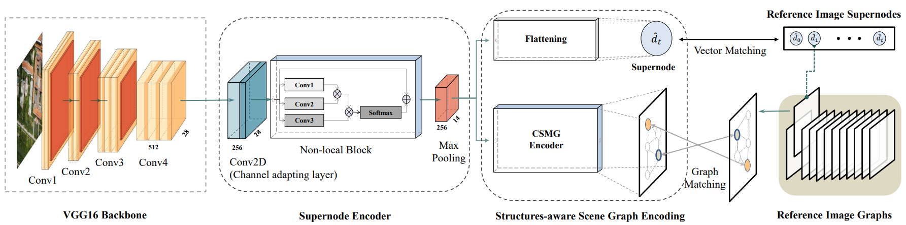

# Scene Graph Matching demo
This is the pytorch implementation for the submitted TGRS paper "A Scene Graph Encoding and Matching Network for UAV Visual Localization".

The detailed implementation of the proposed network (as the following figures show) can be find in .\sceneGraphEncodingNet\nets.py



# Prepare test dataset

Download dataset University-Release from University1652 (https://github.com/layumi/University1652-Baseline) to path ./data like this:
````
.\data
    \University-Release
        \test
            \gallery_satellite
            \query_drone	
	
````

# Run demo

We provide a pre-trained model in ./weights

The R@5 recall results will be saved to file ./recall_results.csv
 